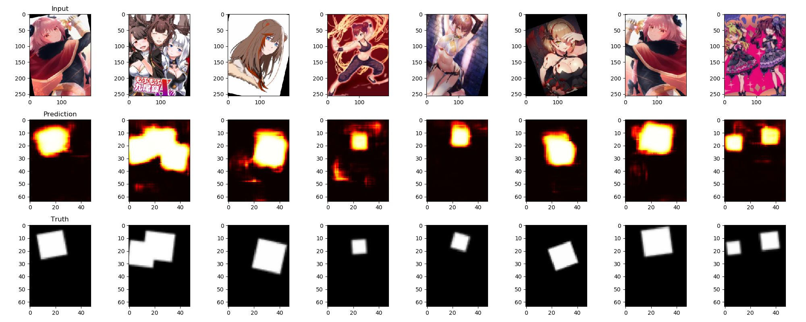
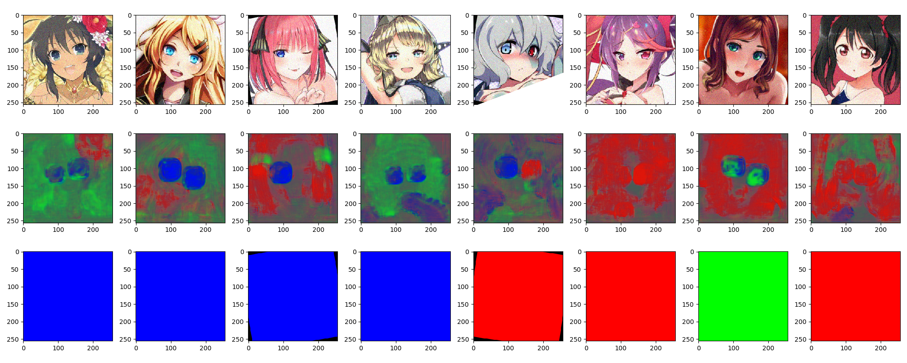
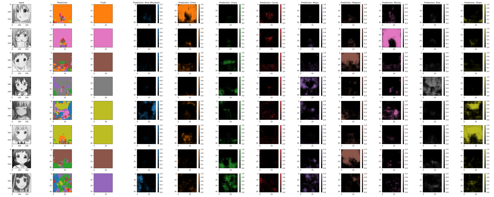

# DeepLearning

## Requirements

- os
- sys
- glob
- tqdm
- numpy
- cv2
- scipy
- PIL
- datetime
- fire
- matplotlib
- seaborn
- tensorflow
- keras
- Rignak_Misc

###### Reinforcement learning specifics

- pygame
- skimage
- Rignak_Games


### Autoencoders

###### Inputs

````shell
>>> python train.py autoencoder anime/fav-rignak --name="anime/autoencoder/fav-rignak" --INPUT_SHAPE=(256,256,3) --OUTPUT_SHAPE=(256,256,3)
````

###### Example


### Segmenter

###### Inputs

````shell
>>> python train.py segmenter anime\face\faces_segmentation --name="anime/segmenter/faces/256-192/64-48" --INPUT_SHAPE=(256,192,3) --OUTPUT_SHAPE=(64,48,3) --LOSS=WBCE --LAST_ACTIVATION=sigmoid --CONV_LAYERS="(32, 64, 128)" 
````

###### Example




### Saliency

Knowing only a classification of the training set, we try to draw the segmentation.

###### Inputs

````shell
>>> python train.py saliency anime/open_eyes/open_eyes  --INPUT_SHAPE="(256,256,3)" --NAME=saliency/open_eyes --OUTPUT_SHAPE="(256,256,1)" --LOSS=binary_crossentropy --training_steps=512 --validation_steps=128 --CONV_LAYERS="(32, 64, 128)"
>>> python train.py saliency anime/eye_color  --INPUT_SHAPE="(256,256,3)" --NAME=saliency/eye_color --OUTPUT_SHAPE="(256,256,3)" --CONV_LAYERS="(32, 64, 128)"
>>> python train.py saliency anime/GochiUsaV2  --INPUT_SHAPE="(256,256,1)" --NAME=saliency/GochiUsaV2 --OUTPUT_SHAPE="(32,32,10)" --CONV_LAYERS="(32, 64, 128)"
````

###### Example







### Categorization on images

###### Inputs

````shell
>>> python train.py inceptionV3 anime/GochiUsaV2 --NAME=GochiUsaV2 --LOSS=crossentropy --INPUT_SHAPE="(256,256,1)"
````


###### Example


.png)

## Dataset location

Since we use multiprocessing, and by doing so multiple simultaneous file access, the datasets have to be put on a SSD.

The folders should be like :

For autoencoders :
  - _{dataset_name}_
    - train
    - val
        
For segmenter :
  - _{dataset_name}_
    - train
       - input
       - output
    - val
      - input
      - output
            
For image to class :
  - _{dataset_name}_ 
    -  train
       - _{label_1}_
       - _{label_2}_
       - ...
    - val
       - _{label_1}_
       - _{label_2}_
       - ...
       
## TODO

Toggle of the lru_cache in command line.
Parameters for data_augmenter (zoom & rotation) in command line.
Choice of the data root in command line.