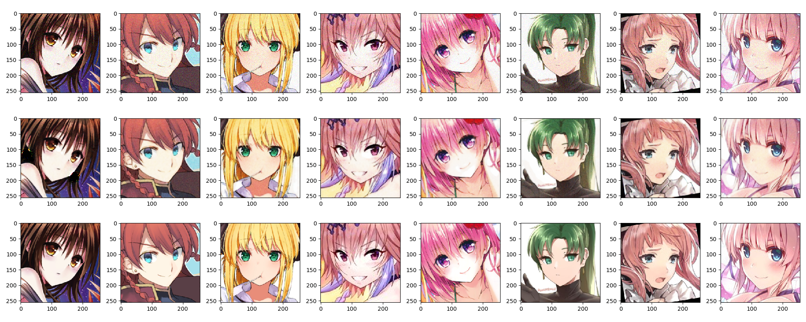
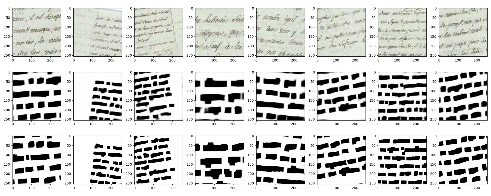
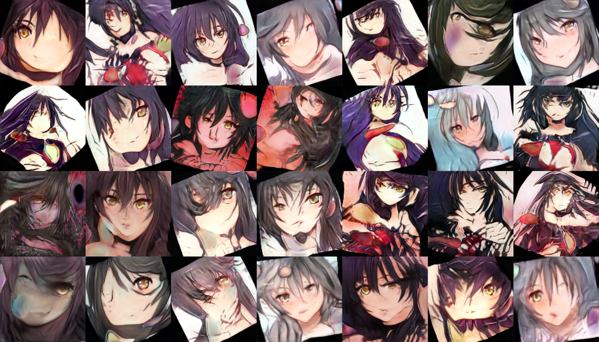

# DeepLearning

- [Requirements](#requirements)
- [Use](#use)
  - Image2Image
      - [Autoencoders](#autoencoders)
      - [Saliency](#saliency)
  - Categorization
      - [Categorizer (image2tag)](#categorization-on-images)
      - [Speech Recognition (sound2tag)](#speech-recognition-specifics)
  - [Optical Character Recognition](#optical-character-recognition)
  - [Reinforcement Learning](#reinforcement-learning)
  - GANs
      - [CycleGan](#)
      - [StyleGan](#)
  - Legacy
      - [Hierarchical Categorizer](#)
- [Dataset location](#)

## Requirements

- os
- sys
- glob
- tqdm
- numpy
- cv2
- scipy
- PIL
- datetime
- fire
- matplotlib
- seaborn
- tensorflow
- keras
- Rignak_Misc

###### Reinforcement learning specifics

- pygame
- skimage
- Rignak_Games

###### Speech recognition specifics

- sounddevice

###### StyleGan specififics

- argparse
- six
- threading
- traceback
- typing
- pprint
- json
- times
- types
- enum
- copy
- io
- pathlib
- pickle
- platform
- re
- shutil
- zipfile
- collections
- tensorboard
- inspect
- uuid


## Use

Autoencoders and categorizer revolve around the *train.py*

````shell
>>> python train.py --help
NAME
    train.py - Train a network

SYNOPSIS
    train.py TASK DATASET <flags>
    
DESCRIPTION
    Train a network
    
POSITIONAL ARGUMENTS
    TASK
        the type of neural network, either "autoencoder", "saliency", "mnist", "categorizer", "style_transfer" or "speech_categorization"
    DATASET
        name of the folder containing the images

FLAGS
    --batch_size=BATCH_SIZE
        size of each batch
````


### Autoencoders

###### Inputs

````shell
>>> python train.py autoencoder fav-rignak
````

###### Outputs

- **_outputs\summary\fav-rignak.txt**, the summary of the neuron network ;
- **_outputs\models\fav-rignak.h5**, the pickled model ;
- **_outputs\history\fav-rignak.png**, the evolution of the loss during the training on both training and validation sets ;
- **_outputs\example\fav-rignak_current.png**, sample input/output/groundtruth of the model during the training on the validation set.

###### Example (NYA)



### Saliency

Knowing only a classification of the training set, we try to draw the segmentation.

###### Inputs

````shell
>>> python train.py saliency open_eye
````

Supports dataset with two and three class.

###### Outputs

- **_outputs\summary\open_eyes.txt**, the summary of the neuron network ;
- **_outputs\models\open_eyes.h5**, the pickled model ;
- **_outputs\history\open_eyes.png**, the evolution of the loss during the training on both training and validation sets ;
- **_outputs\example\open_eyes_current.png**, sample input/output/groundtruth of the model during the training on the validation set.

###### Example


### Categorization on images

###### Inputs

````shell
>>> python train.py categorizer waifu
````

###### Outputs

- **_outputs\summary\waifu.txt**, the summary of the neuron network ;
- **_outputs\models\waifu.h5**, the pickled model ;
- **_outputs\history\waifu.png**, the evolution of the loss during the training on both training and validation sets ;
- **_outputs\confusion\waifu.png**, confusion of the model during the training on the validation set.


###### Example


### Categorization on sound

Using the spectrogram of the sound, we convert the .wav into .png. Thus, we can apply the classic computer vision methods.

###### Dataset examples

- 経済


- 消しゴム


The images will then be categorized as a classical single label problem.

### Optical Character Recognition

First we train a segmenter to get thumbnails of each word.

````shell
>>> python train.py style_transfer text_segmentation
````



Then, we apply the segmentation:

```
> python OCR/apply_segmentation.py --help
NAME
    apply_segmentation.py - Use a trained segmentation model to create the thumbnail of each segmented element.
    
SYNOPSIS
    apply_segmentation.py MODEL_FILENAME <flags>
    
DESCRIPTION
    Use a trained segmentation model to create the thumbnail of each segmented element.
    
POSITIONAL ARGUMENTS
    MODEL_FILENAME
        name of the file containing a model trained for the segmentation
        
FLAGS
    --input_folder=INPUT_FOLDER
        folder containing the images to segment
    --output_folder=OUTPUT_FOLDER
        folder which will contain the thumbnails
```


    >>> python OCR/apply_segmentation.py _outputs/models/text_segmentation.h5
    


Then we train a categorizer. Due to lack of data, we try to use MNIST

````shell
>>> python train.py categorizer mnist
````


The we apply the model to the thumbnails :

````shell
````


### Reinforcement learning

###### Inputs

````shell
>>> cd ReinforcementLearning
>>> python Launcher.py Asteroid 
````

###### Outputs


### CycleGan

Cloned from https://github.com/eriklindernoren/Keras-GAN/tree/master/cyclegan

###### Inputs

````shell
>>> cd CycleGan
>>> python cyclegan.py
````

###### Outputs


### StyleGan

Cloned from https://github.com/NVlabs/stylegan

###### Inputs

````shell
>>> cd StyleGan
>>> python train.py
````

Once a model is trained, we can generate pictures with :

````shell
>>> python run.py --help
NAME
    run.py - Create images from a given model
SYNOPSIS
    run.py <flags>
DESCRIPTION
    Create images from a given model
FLAGS
    --model_filename=MODEL_FILENAME
        name of the model to use
    --truncation_psi=TRUNCATION_PSI
        originality factor, close to 0 means less originality
    --result_root=RESULT_ROOT
        name of the folder to contain the output
    --number_of_pictures=NUMBER_OF_PICTURES
        number of picture to generate
````

We can also do interpolation videos (ffmpeg must be installed) :

````shell
>>> python video.py --help
NAME
    video.py - Create an interpolation video
    
SYNOPSIS
    video.py <flags>
    
DESCRIPTION
    Create an interpolation video
    
FLAGS
    --model_filename=MODEL_FILENAME
        name of the file containing the models
    --truncation_psi=TRUNCATION_PSI
        originality factor, closer to 0 means less original
    --result_root=RESULT_ROOT
        name of the folder to contains the output
    --duration=DURATION
        length, in seconds, of the video to create
    --grid_dim=GRID_DIM
        number of thumbnails on each row and columns of the video
    --fps=FPS
        frame per seconds
    --image_zoom=IMAGE_ZOOM
        zoom applied on the output
````

###### Outputs

Groundtruth :


Results :


That's what happen when we train a StyleGan with not enough of a GPU.